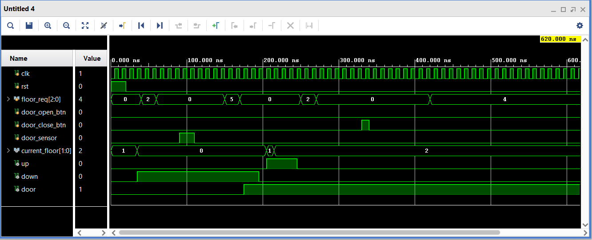
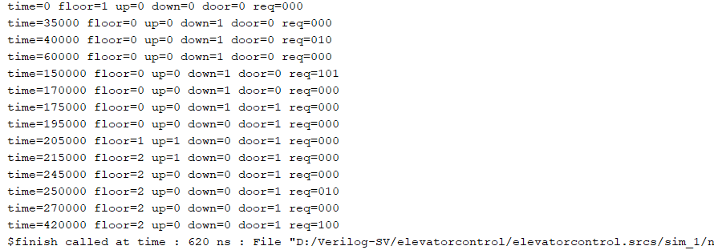

# Elevator-Control-System-Verilog

## Overview

This project implements an **Elevator Control System** using **Verilog HDL**.
The system simulates the behavior of a multi-floor elevator that responds to floor requests and manages elevator movement and door operations.

The design is implemented using a **Finite State Machine (FSM)** and simulated using **Xilinx Vivado**.

---

## Features

* FSM-based elevator controller
* Handles multiple floor requests
* Elevator movement control (Up / Down)
* Door open and close operations
* Testbench for simulation verification

---

## Tools Used

* Verilog HDL
* Xilinx Vivado Design Suite

---

## Project Files

* `elevator_controller.v` – Main elevator controller design module
* `elevator_controller_tb.v` – Testbench for simulation
* `elevator_controller_waveform.png` – Simulation waveform output
* `elevator_controller_tcl_console.png` – TCL console output from simulation
* `README.md` – Project documentation

---

## Simulation Waveform

The simulation waveform generated in **Vivado** shows elevator movement between floors along with control signals such as direction and door status.

---

## TCL Console Output

The TCL console output displays monitored signals including **current floor, elevator direction, door status, and floor requests**, confirming correct operation of the elevator controller.

---

## Applications

* Smart elevator control systems
* FPGA-based control systems
* Embedded system automation
* Real-time digital control systems

---

## Author

**Manoj Kumar Naik Mudu**
